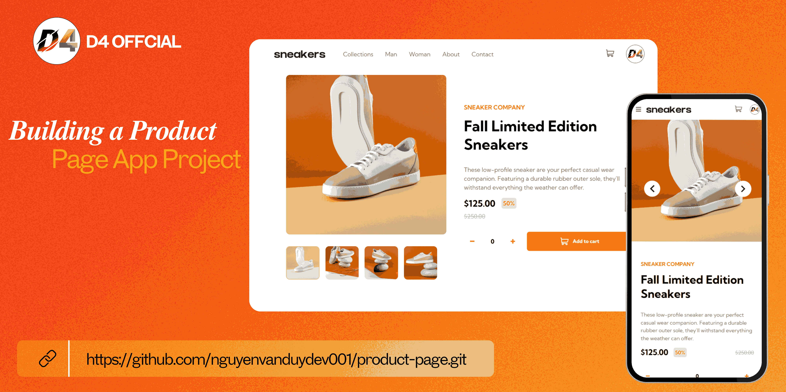

# Building a Product Page App Project

## Demo


## Installation instructions

```
git clone https://github.com/nguyenvanduydev001/product-page.git
```
----

## What the project helps to learn
Below are some of the noteworthy functions:

1. A product page incorporated pictures, particulars, prices, and add-to-cart.
2. Implement dynamic pricing that adjusts based on quantity or promotional offers.
3. Include product reviews and a rating system.
   
This project will test your CSS layout capabilities and challenge you to introduce dynamic behaviors with JavaScript. Working on this kind of project provides hands-on experience, enhances your understanding of user experience, and deepens your skills in web development, especially with HTML, CSS, and JavaScript.

[Live demo](https://product-page-nvd.netlify.app/)
